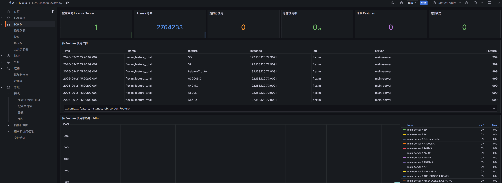
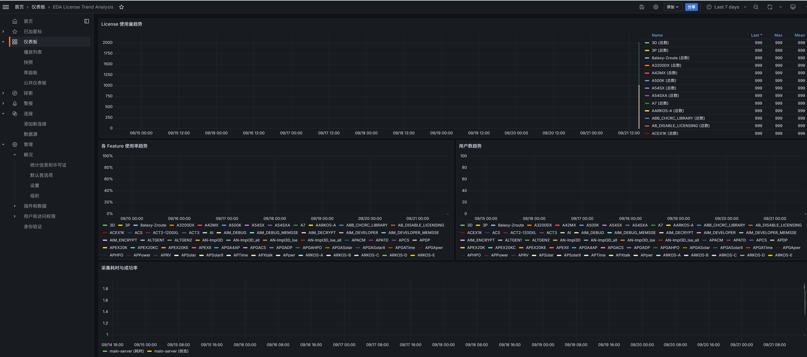
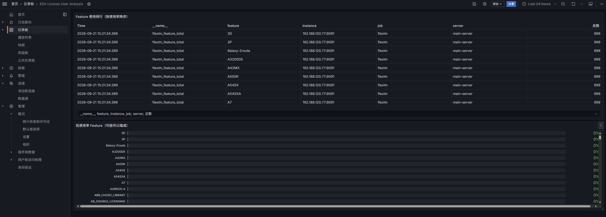

# EDA License Monitor

**FlexLM EDA License 使用率监控系统** | Python & Rust 双语言采集器 + Prometheus + Grafana

> 芯片公司最贵的资源不在服务器机房，在 lmutil 的输出里。


  

[快速开始](#快速开始) · [为什么要做](#为什么要做) · [架构设计](#架构设计) · [Python vs Rust](#python-vs-rust) · [FAQ](#常见问题)

---

## 为什么要做

EDA License 是芯片公司最贵的运维资产之一，但几乎所有团队的管理方式都停留在 `lmutil lmstat` 命令行阶段。

**你有没有遇到过这些问题？**

- 工程师排队等 VCS License，你打开 `lmutil lmstat -a` 看到一堆数字，但不知道趋势
- 厂商续约时，你拿什么数据证明"我们确实需要加 License"？
- 有些 Feature 使用率低于 20%，但续约时还是全量买了
- License 紧张时，谁在用、用了多久、能不能释放——全靠吼

本项目提供一套**开箱即用的监控方案**：从 lmutil 输出解析到 Grafana 可视化仪表盘，15 分钟部署完成。

提供 **Python** 和 **Rust** 两种采集器实现，共享同一套配置、Prometheus 指标和 Grafana 仪表盘。

## 快速开始

### Docker Compose（推荐）

```bash
git clone https://github.com/xlbbb-cn/eda-license-monitor.git
cd eda-license-monitor

# 编辑配置：填入你的 License Server 地址
cp config/config.yaml config/config.local.yaml
vim config/config.local.yaml

# 启动（默认使用 Rust 采集器）
docker compose up -d

# 改用 Python 采集器（两个采集器只能启用一个，否则会重复上报同名指标）
docker compose stop collector-rust
docker compose --profile python up -d collector-python
```

| 服务 | 地址 | 说明 |
|------|------|------|
| **Grafana** | http://localhost:3000 | 账号 `admin`，密码 `eda-license-2025` |
| Prometheus | http://localhost:9090 | 查看采集状态和原始指标 |
| Metrics | http://localhost:9091/metrics | 采集器暴露的 Prometheus 指标端点 |

### 从 Release 下载（免编译）

部署机器上没有 Docker，也不想装 Rust 工具链，可以直接用 Release 里的预编译产物：

```bash
# Rust 采集器：静态链接（musl），无运行时依赖，CentOS 6.8+ 可用
curl -LO https://github.com/xlbbb-cn/eda-license-monitor/releases/download/v1.0.1/eda-license-collector-v1.0.1-linux-x86_64-static.tar.gz
tar xzf eda-license-collector-v1.0.1-linux-x86_64-static.tar.gz
./eda-license-collector -c config/config.yaml --once

# Python 采集器：装 wheel，不用 clone 仓库
pip install https://github.com/xlbbb-cn/eda-license-monitor/releases/download/v1.0.1/eda_license_monitor-0.1.0-py3-none-any.whl
```

> 上面的版本号是 v1.0.1。新版本请到 [Releases](https://github.com/xlbbb-cn/eda-license-monitor/releases) 取对应的下载地址。

### 手动部署

选择一种语言的采集器：

**Python**

```bash
cd collector/python
pip install -r requirements.txt

# 单次采集测试
python prometheus_exporter.py -c ../../config/config.yaml --once

# 持续采集
python prometheus_exporter.py -c ../../config/config.yaml
```

**Rust**

```bash
cd collector/rust

# 编译
cargo build --release

# 单次采集测试
./target/release/eda-license-collector -c ../../config/config.yaml --once

# 持续采集
./target/release/eda-license-collector -c ../../config/config.yaml
```

> 需要开机自启、崩溃自动重启（裸机生产环境）？见 [裸机部署与 systemd 服务化](docs/bare-metal-deployment.md)。

### 配置

只需修改 `config/config.yaml` 中的一个字段：

```yaml
license_servers:
  - name: "main-server"
    host: "192.168.1.100"    # 改为你的 License Server IP
    port: 27000              # FlexLM Server 端口
```

更多配置项见 [config/config.yaml](config/config.yaml)。

## 架构设计

```
  ┌─────────────────────┐
  │  FlexLM License     │   lmgrd + vendor daemon
  │  Server             │   (VCS / Xcelium / PT / DC / ...)
  │  端口 27000         │
  └──────────┬──────────┘
             │ lmutil lmstat -a (每 30s)
             ▼
  ┌─────────────────────┐     ┌──────────────────┐
  │  Data Collector     │────▶│  Prometheus       │
  │  Rust / Python      │     │  时序数据库       │
  │  端口 9091          │     │  端口 9090        │
  └─────────────────────┘     └────────┬─────────┘
                                       │ PromQL
                                       ▼
                            ┌──────────────────┐
                            │  Grafana          │
                            │  可视化仪表盘     │
                            │  端口 3000        │
                            └──────────────────┘
```

详细架构说明见 [docs/architecture.md](docs/architecture.md)。

## Python vs Rust

两种采集器**功能完全等价**，共享同一套配置文件、Prometheus 指标名称和 Grafana 仪表盘。选择你团队更熟悉的语言即可。

| | Python | Rust |
|---|---|---|
| **采集器路径** | `collector/python/` | `collector/rust/` |
| **入口脚本** | `prometheus_exporter.py` | `eda-license-collector` (二进制) |
| **依赖** | Python 3.9+、prometheus-client、PyYAML | Rust 1.85+、Cargo |
| **Docker 镜像** | ~120 MB（python:3.11-slim 基础） | ~15 MB（debian:bookworm-slim 基础） |
| **内存占用** | ~30-50 MB | ~5-10 MB |
| **启动速度** | ~1s | <0.1s |
| **单次采集性能** | ~50ms | ~5ms |
| **适合场景** | 快速原型、团队 Python 技术栈为主 | 生产环境、资源敏感、追求性能 |
| **维护成本** | 低（Python 生态成熟） | 低（依赖少、编译后无运行时依赖） |

**指标一致性保证**：Rust 版本的 Prometheus 指标名称、标签、HELP 文本与 Python 版完全一致，切换采集器无需修改 Prometheus 配置或 Grafana 仪表盘。

```bash
# Rust 测试中直接断言解析结果与 Python 版一致（期望值取自 Python 解析器）
cargo test --manifest-path collector/rust/Cargo.toml

# 对照 Python 版解析器对同一批样例（collector/rust/tests/fixtures）的输出
python collector/rust/tests/python_parity_check.py
```

## 核心功能

- **Feature 级监控**：每个 Feature 的总数、已用、空闲、使用率
- **用户追踪**：谁在用、用了多久、占了多少席位
- **趋势分析**：小时/天/周维度的使用率变化趋势
- **多 Server 支持**：同时监控多台 License Server
- **告警通知**：使用率过高、License 占满、Server 不可达自动告警
- **双语言采集器**：Python / Rust 可无缝切换
- **一键部署**：Docker Compose 开箱即用

## 仪表盘说明

`docker compose up -d` 会通过 Grafana file provisioning 自动导入以下三个仪表盘。如果你已经有自己的 Grafana / Prometheus，只想拿仪表盘，可以直接从 GitHub raw 导入，不需要克隆仓库：

```text
https://raw.githubusercontent.com/xlbbb-cn/eda-license-monitor/main/grafana/provisioning/dashboards/overview.json
https://raw.githubusercontent.com/xlbbb-cn/eda-license-monitor/main/grafana/provisioning/dashboards/trend.json
https://raw.githubusercontent.com/xlbbb-cn/eda-license-monitor/main/grafana/provisioning/dashboards/users.json
```

> 仪表盘内写死了数据源 `uid: prometheus`，你的数据源 uid 不匹配时面板会显示 No data；完整注意事项见[快速开始](docs/quickstart.md#导入-grafana-仪表盘)。

### Overview（总览）

6 个核心指标卡片 + Feature 使用详情表 + 24h 使用率趋势图


### Trend Analysis（趋势分析）

多维度趋势图：License 总数 vs 已用、使用率变化、用户数变化、采集性能


### User Analysis（用户分析）

使用排行表（按使用率降序）、低使用率 Feature 识别（辅助续约决策）


## Prometheus 指标

| 指标名 | 类型 | 说明 |
|--------|------|------|
| `flexlm_feature_total` | Gauge | License 总数 |
| `flexlm_feature_used` | Gauge | 已使用数 |
| `flexlm_feature_idle` | Gauge | 空闲数 (total - used) |
| `flexlm_feature_users` | Gauge | 占用用户数 |
| `flexlm_server_status` | Gauge | Server 状态 (1=UP, 0=DOWN) |
| `flexlm_server_features_total` | Gauge | Server 上 Feature 总数 |
| `flexlm_scrape_duration_seconds` | Gauge | 采集耗时 |
| `flexlm_scrape_total` | Counter | 采集次数（按状态分） |

## 常见问题

<details>
<summary><b>Q: Python 和 Rust 采集器应该选哪个？</b></summary>

如果团队 Python 技术栈为主，先用 Python 快速跑起来；如果部署在生产环境且对资源敏感，切换到 Rust 版本。两者的配置文件和指标完全一致，随时可以无缝切换。
</details>

<details>
<summary><b>Q: 采集器会不会打挂 License Server？</b></summary>

不会。默认 30 秒采集一次，每次只发送一个 `lmutil lmstat -a` 请求，对 License Server 的负载可以忽略不计。建议采集间隔不低于 30 秒（见 `config/config.yaml` 的 `collector.interval`）；License Server 连接数紧张时，生产环境可以用 60 秒。
</details>

<details>
<summary><b>Q: 不安装 lmutil 能用吗？</b></summary>

不能。采集器通过调用 FlexLM 官方的 `lmutil` 命令行工具获取数据，这是 FlexLM 的标准接口。你需要在采集器所在机器上安装 FlexLM 客户端（不需要 Server 端）。
</details>

<details>
<summary><b>Q: 支持哪些 EDA 工具的 License？</b></summary>

只要使用 FlexLM（FlexNet）许可证管理器的工具都支持，包括但不限于：Synopsys VCS/Xcelium/Design Compiler/PrimeTime、Cadence Xcelium/Innovus/Tempus、Siemens Questa/VCS 等。
</details>

<details>
<summary><b>Q: 数据保留多久？</b></summary>

Prometheus 默认保留 90 天（可通过 `--storage.tsdb.retention.time` 调整）。建议原始数据保留 90 天，聚合数据通过 Recording Rules 保留 2 年以上。
</details>

<details>
<summary><b>Q: 可以接入飞书/钉钉告警吗？</b></summary>

可以。通过 AlertManager 的 Webhook 配置，支持飞书机器人、钉钉机器人、企业微信机器人等。配置方法见 [config/alertmanager.yml](config/alertmanager.yml)。
</details>

<details>
<summary><b>Q: 如何监控多台 License Server？</b></summary>

在 `config.yaml` 的 `license_servers` 列表中添加多个条目即可：

```yaml
license_servers:
  - name: "server-1"
    host: "192.168.1.100"
    port: 27000
  - name: "server-2"
    host: "192.168.1.101"
    port: 27000
```

Grafana 仪表盘会自动按 Server 分组展示。
</details>

<details>
<summary><b>Q: Rust 版本如何更新？</b></summary>

Rust 版本与 Python 版本共享配置和指标。更新时只需 `git pull`，然后重新编译（`cargo build --release`）或重新构建 Docker 镜像即可。
</details>

## 路线图

- [ ] License 使用预测（基于历史数据的线性回归）
- [ ] 成本分析面板（每个 Feature 的单次使用成本）
- [ ] Webhook 通知增强（飞书/钉钉/企微开箱即用）
- [ ] 与调度系统联动（License 不足时自动排队）
- [ ] 多 License Manager 类型支持（LM-X、Sentinel HASP）
- [ ] Rust 采集器：Windows 原生支持（无需 WSL）

## 贡献

欢迎提交 Issue 和 Pull Request。

1. Fork 本仓库
2. 创建特性分支 (`git checkout -b feature/amazing-feature`)
3. 提交修改 (`git commit -m 'Add amazing feature'`)
4. 推送分支 (`git push origin feature/amazing-feature`)
5. 创建 Pull Request

### 开发指南

- **Python 代码规范**：遵循 PEP 8，使用 `black` 格式化
- **Rust 代码规范**：遵循 `rustfmt` 默认配置，`clippy` 无警告
- **添加新指标**：需同时修改 `collector/python/prometheus_exporter.py` 和 `collector/rust/src/metrics.rs`
- **运行测试**：

```bash
# Python
cd collector/python && python -m pytest

# Rust
cd collector/rust && cargo test
```

## 联系方式

- 知乎：[@xlbbb-cn](https://www.zhihu.com/people/xlbbb-cn)
- 公众号：xlbbb-cn
- GitHub：[xlbbb-cn](https://github.com/xlbbb-cn)

如果你的团队正在搭建 EDA 研发基础设施，欢迎私信交流。

## License

[MIT](LICENSE)
